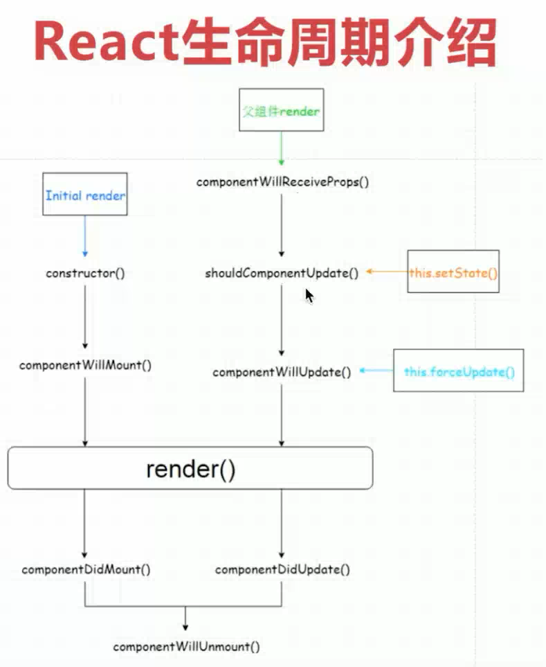
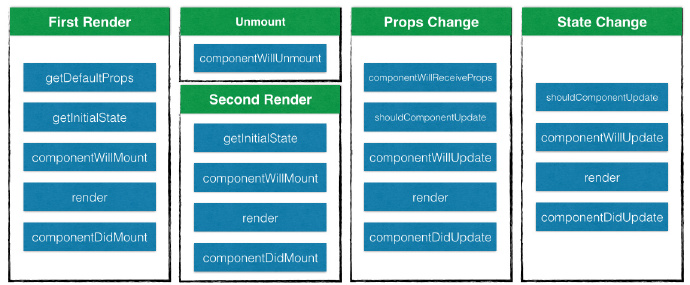

### 前言

在组件的整个生命周期中，随着该组件的props或者state发生改变，其DOM表现也会有相应的变化。一个组件就是一个状态机，对于特定地输入，它总返回一致的输出。

一个React组件的生命周期分为三个部分：实例化、存在期和销毁时。

## 实例化

当组件在**客户端**被实例化，第一次被创建时，以下方法依次被调用：

1、getDefaultProps
2、getInitialState
3、componentWillMount
4、render
5、componentDidMount

当组件在**服务端**被实例化，首次被创建时，以下方法依次被调用：

1、getDefaultProps
2、getInitialState
3、componentWillMount
4、render

componentDidMount 不会在服务端被渲染的过程中调用。




### Ract生命周期

React 生命周期分为三种状态 1. 初始化 2.更新 3.销毁


#### **初始化**

##### *1、getDefaultProps()*

> 设置默认的props，也可以用dufaultProps设置组件的默认属性.

##### *2、getInitialState()*

> 在使用es6的class语法时是没有这个钩子函数的，可以直接在constructor中定义this.state。此时可以访问this.props

##### *3、componentWillMount()*

> 组件初始化时只调用，以后组件更新不调用，整个生命周期只调用一次，此时可以修改state。

##### *4、 render()*

> react最重要的步骤，创建虚拟dom，进行diff算法，更新dom树都在此进行。此时就不能更改state了。

##### *5、componentDidMount()*

> 组件渲染之后调用，只调用一次。

#### **更新**

##### *6、componentWillReceiveProps(nextProps)*

> 组件初始化时不调用，组件接受新的props时调用。

##### *7、shouldComponentUpdate(nextProps, nextState)*

> react性能优化非常重要的一环。组件接受新的state或者props时调用，我们可以设置在此对比前后两个props和state是否相同，如果相同则返回false阻止更新，因为相同的属性状态一定会生成相同的dom树，这样就不需要创造新的dom树和旧的dom树进行diff算法对比，节省大量性能，尤其是在dom结构复杂的时候

##### *8、componentWillUpdata(nextProps, nextState)*

> 组件初始化时不调用，只有在组件将要更新时才调用，此时可以修改state

##### *9、render()*

> 组件渲染

##### *10、componentDidUpdate()*

> 组件初始化时不调用，组件更新完成后调用，此时可以获取dom节点。

#### *卸载**

##### *11、componentWillUnmount()*

> 组件将要卸载时调用，一些事件监听和定时器需要在此时清除。


## Code示例

### 1. **getDefaultProps**

对于每个组件实例来讲，这个方法只会调用一次，该组件类的所有后续应用，getDefaultPops 将不会再被调用，其返回的对象可以用于设置默认的 props(properties的缩写) 值。

```
var Hello = React.creatClass({
    getDefaultProps: function(){
        return {
            name: 'pomy',
            git: 'dwqs'
        }
    },
    
    render: function(){
        return (
            <div>Hello,{this.props.name},git username is {this.props.dwqs}</div>
        )
    }
});

ReactDOM.render(<Hello />, document.body);
```

也可以在挂载组件的时候设置 props：

```
var data = [{title: 'Hello'}];
<Hello data={data} />
```

或者调用 `setProps` （一般不需要调用）来设置其 props：

```
var data = [{title: 'Hello'}];
var Hello = React.render(<Demo />, document.body);
Hello.setProps({data:data});
```

**但只能在子组件或组件树上调用 setProps。别调用 this.setProps 或者 直接修改 this.props。将其当做只读数据。**

React通过 `propTypes` 提供了一种验证 props 的方式，`propTypes` 是一个配置对象，用于定义属性类型：

```
var survey = React.createClass({
    propTypes: {
        survey: React.PropTypes.shape({
            id: React.PropTypes.number.isRequired
        }).isRequired,
        onClick: React.PropTypes.func,
        name: React.PropTypes.string,
        score: React.PropTypes.array
        ...
    },
    
    //...
})
```

组件初始化时，如果传递的属性和 `propTypes` 不匹配，则会打印一个 console.warn 日志。如果是可选配置，可以去掉.isRequired。常用的 PropTypes 如下：略


### 2. **getInitialState**

对于组件的每个实例来说，这个方法的调用**有且只有一次，**用来初始化每个实例的 state，在这个方法里，可以访问组件的 props。每一个React组件都有自己的 state，其与 props 的区别在于 state只存在组件的内部，props 在所有实例中共享。

getInitialState 和 getDefaultPops 的调用是有区别的，getDefaultPops 是对于组件类来说只调用一次，后续该类的应用都不会被调用，而 getInitialState 是对于每个组件实例来讲都会调用，并且只调一次。

```
var LikeButton = React.createClass({
  getInitialState: function() {
    return {liked: false};
  },
  handleClick: function(event) {
    this.setState({liked: !this.state.liked});
  },
  render: function() {
    var text = this.state.liked ? 'like' : 'haven\'t liked';
    return (
      <p onClick={this.handleClick}>
        You {text} this. Click to toggle.
      </p>
    );
  }
});

ReactDOM.render(
  <LikeButton />,
  document.getElementById('example')
);
```

每次修改 state，都会重新渲染组件，实例化后通过 state 更新组件，会依次调用下列方法：

1、shouldComponentUpdate
2、componentWillUpdate
3、render
4、componentDidUpdate

但是**不要直接修改 this.state，要通过 this.setState 方法来修改。**


### 3. **componentWillMount**

该方法在首次渲染之前调用，也是再 render 方法调用之前修改 state 的最后一次机会。

### 4. **render**

该方法会创建一个虚拟DOM，用来表示组件的输出。对于一个组件来讲，render方法是唯一一个必需的方法。render方法需要满足下面几点：

1. 只能通过 this.props 和 this.state 访问数据（不能修改）
2. 可以返回 null,false 或者任何React组件
3. 只能出现一个顶级组件，不能返回一组元素
4. 不能改变组件的状态
5. 不能修改DOM的输出

render方法返回的结果并不是真正的DOM元素，而是一个虚拟的表现，类似于一个DOM tree的结构的对象。react之所以效率高，就是这个原因。


### 5. **componentDidMount**

该方法不会在服务端被渲染的过程中调用。该方法被调用时，已经渲染出真实的 DOM，可以再该方法中通过 `this.getDOMNode()` 访问到真实的 DOM(推荐使用 `ReactDOM.findDOMNode()`)。

```
var data = [..];
var comp = React.createClass({
    render: function(){
        return <imput .. />
    },
    componentDidMount: function(){
        $(this.getDOMNode()).autoComplete({
            src: data
        })
    }
})
```

由于组件并不是真实的 DOM 节点，而是存在于内存之中的一种数据结构，叫做虚拟 DOM （virtual DOM）。只有当它插入文档以后，才会变成真实的 DOM 。有时需要从组件获取真实 DOM 的节点，这时就要用到 `ref` 属性：

```
var Area = React.createClass({
    render: function(){
        this.getDOMNode(); //render调用时，组件未挂载，这里将报错
        
        return <canvas ref='mainCanvas'>
    },
    componentDidMount: function(){
        var canvas = this.refs.mainCanvas.getDOMNode();
        //这是有效的，可以访问到 Canvas 节点
    }
})
```

需要注意的是，由于 `this.refs.[refName]` 属性获取的是真实 DOM ，所以必须等到虚拟 DOM 插入文档以后，才能使用这个属性，否则会报错。


## 存在期

此时组件已经渲染好并且用户可以与它进行交互，比如鼠标点击，手指点按，或者其它的一些事件，导致应用状态的改变，你将会看到下面的方法依次被调用

1、componentWillReceiveProps
2、shouldComponentUpdate
3、componentWillUpdate
4、render
5、componentDidUpdate


### 6. **componentWillReceiveProps**

组件的 props 属性可以通过父组件来更改，这时，componentWillReceiveProps 将来被调用。可以在这个方法里更新 state,以触发 render 方法重新渲染组件。

```
componentWillReceiveProps: function(nextProps){
    if(nextProps.checked !== undefined){
        this.setState({
            checked: nextProps.checked
        })
    }
}
```

### 7. **shouldComponentUpdate**

如果你确定组件的 props 或者 state 的改变不需要重新渲染，可以通过在这个方法里通过返回 `false` 来阻止组件的重新渲染，返回 `false 则不会执行 render 以及后面的 componentWillUpdate，componentDidUpdate 方法。

该方法是非必须的，并且大多数情况下没有在开发中使用。

```
shouldComponentUpdate: function(nextProps, nextState){
    return this.state.checked === nextState.checked;
    //return false 则不更新组件
}
```

### 8. **componentWillUpdate**

这个方法和 componentWillMount 类似，在组件接收到了新的 props 或者 state 即将进行重新渲染前，componentWillUpdate(object nextProps, object nextState) 会被调用，**注意不要在此方面里再去更新 props 或者 state。**

### 9. **componentDidUpdate**

这个方法和 componentDidMount 类似，在组件重新被渲染之后，componentDidUpdate(object prevProps, object prevState) 会被调用。可以在这里访问并修改 DOM。


## 销毁时

### 10 **componentWillUnmount**

每当React使用完一个组件，这个组件必须从 DOM 中卸载后被销毁，此时 componentWillUnmout 会被执行，完成所有的清理和销毁工作，在 componentDidMount 中添加的任务都需要再该方法中撤销，如创建的定时器或事件监听器。

当再次装载组件时，以下方法会被依次调用：

1、getInitialState
2、componentWillMount
3、render
4、componentDidMount

## 反模式

在 getInitialState 方法中，尝试通过 this.props 来创建 state 的做法是一种反模式。

```
//反模式
getDefaultProps: function(){
    return {
        data: new Date()
    }
},
getInitialState: function(){
    return {
        day: this.props.date - new Date()
    }
},
render: function(){
    return <div>Day:{this.state.day}</div>
}
```

经过计算后的值不应该赋给 state，正确的模式应该是在渲染时计算这些值。这样保证了计算后的值永远不会与派生出它的 props 值不同步。

```
//正确模式
getDefaultProps: function(){
    return {
        data: new Date()
    }
},
render: function(){
    var day = this.props.date - new Date();
    return <div>Day:{day}</div>
}
```

如果只是简单的初始化 state，那么应用反模式是没有问题的。

## 总结

以下面的一张图总结组件的生命周期：

 


深入探索react生命周期：https://segmentfault.com/a/1190000003940416?utm_source=Weibo&utm_medium=shareLink&utm_campaign=socialShare


### 具体示例Code

参考本目录的《readme.md》

