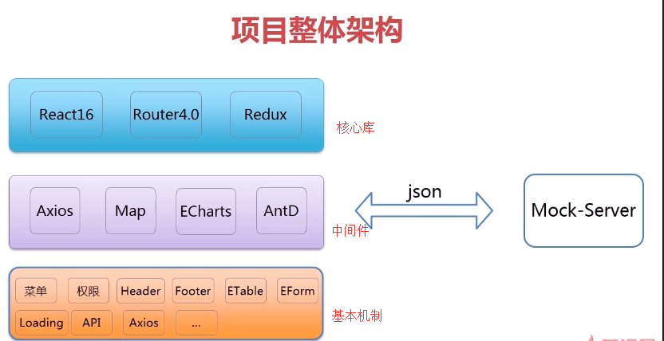
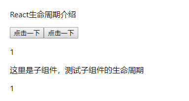
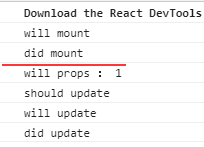

# React全家桶+AntD单车后台管理系统开发

#### React 全家桶

+ React基础知识、生命周期
+ Router4.0语法讲解
+ Redux集成开发

#### AntD UI组件

+ 最实用的基础组件 
+ AntD栅格系统
+ ETable组件封装
+ BaseForm组件封装   ----
+ 表格内嵌单选、复选封装

#### 公共机制封闭

+ Axios请求插件封闭
+ API封装
+ 错误拦截
+ 权限、菜单封装
+ 日期、金额、手机号封装
+ Loading、分页、Mock...


#### 项目整体架构




#### 生态介绍

- Vue生态：Vue + Vue-Router + Vuex + Axios + Babel + Webpack ...
- React生态：React + React-Router + Redux + Axios + Babel + Webpack ...

Redux : 没有关系间的组件间通信

编程式实现：需要以具体代码表达在哪里，做什么，如何实现

声明式实现： 只需要声明在哪里，做什么，无需关心如何实现


## React脚手架、Yarn介绍

+ #### 如何安装和使用React脚手架

~~~
npm 官网： https://facebook.github.io/create-react-app/docs/getting-started
官网 ： https://reactjs.org/docs/create-a-new-react-app.html

npm i -g create-react-app my-app
create-react-app my-app
cd my-app
npm start

官网新使用：
npx create-react-app my-app
cd my-app
npm start
~~~

+ #### Yarn

~~~ 
使用方法： https://yarn.bootcss.com/docs/usage/
~~~

#####  什么是Yarn

+ Yarn是新的一代包管理工具

##### 为什么使用Yarn

+ 速度快
+ 安装版本统一，更安全     *Yarn可以把版本锁定，使项目的版本统一*
+ 更简洁的输出
+ 更好的语义化

##### 如何使用Yarn

+ yarn init   初始化项目
+ yarn add   安装一个包
+ yarn remove   删除一个包
+ yarn  / yarn install   安装项目依赖


##### react脚手架与webpack

react脚手架已经把webpack封装起来了，我们只需要关注code实现就行了

如果需要改webpack，就需要通过```eject```来暴露出webpack


## 项目安装的依赖：

~~~
yarn add react-router
~~~


## 目录结构

```js
+-- build/                                  ---打包的文件目录
+-- config/                                 ---npm run eject 后的配置文件目录
+-- node_modules/                           ---npm下载文件目录
+-- public/                                 
|   --- index.html							---首页入口html文件
+-- src/                                    ---核心代码目录
|   +-- pages                          ---测试demo
|   |    +-- demo                      ---生命周期测试demo
|   |    |    --- ...   
|   |    +-- route_demo                      ---react-router-dom测试demo
|   |    |    --- route1                     --- 一般路由写法
|   |    |    --- route2         --- 路由与DOM分开，功能与route1一样（可对比route1)
|   |    |    --- route3                     ---嵌套路由
|   |    |    --- route4                     ---动态路由
|   |    +-- dashboard                      ---首页组件
|   |    |    --- ...   
|   |    +-- forms                          ---表单组件
|   |    |    --- ...   
|   |    +-- pages                          ---页面组件
|   |    |    --- ...   
|   |    +-- tables                         ---表格组件
|   |    |    --- ...   
|   |    +-- ui                             ---ui组件
|   |    |    --- ...   
|   |    --- BreadcrumbCustom.jsx           ---面包屑组件
|   |    --- HeaderCustom.jsx               ---顶部导航组件
|   |    --- Page.jsx                       ---页面容器
|   |    --- SiderCustom.jsx                ---左边菜单组件
|   +-- style                               ---项目的样式存放目录，主要采用less编写
|   +-- utils                               ---工具文件存放目录
|   --- App.js                              ---组件入口文件
|   --- index.js                            ---项目的整体js入口文件，包括路由配置等
--- .env                                    ---启动项目自定义端口配置文件
--- .eslintrc                               ---自定义eslint配置文件，包括增加的react jsx语法限制
--- package.json                                    
```


## React生命周期介绍

基础介绍请看本目录的文件《React生命周期.md》

在项目中的代码示例：

src/index.js

~~~
import React from 'react';
import ReactDOM from 'react-dom';
import './index.css';
import ReactLife from './page/demo/ReactLife';
import * as serviceWorker from './serviceWorker';

ReactDOM.render(<ReactLife />, document.getElementById('root'));

// If you want your app to work offline and load faster, you can change
// unregister() to register() below. Note this comes with some pitfalls.
// Learn more about service workers: http://bit.ly/CRA-PWA
serviceWorker.unregister();

~~~

src/page/demo/ReactLife.js

~~~
/*生命周期函数测试
实现：通过点击按钮改变state值
ReactLife给Child传参数

知识点：
1.看它俩的this及箭头函数的使用方法
   onClick={this.handleAdd} ---  handleAdd=()=>{箭头函数的this是组件的实例}
   onClick={this.handleClick.bind(this)} ---  handleClick(){这个非箭头函数的this不是组件的实例，
    所以在调用的时候要用到.bind(this)}
   

 */
import React from 'react'
import Child from './Child'

export default class ReactLife extends React.Component{
    constructor(props){
        super(props);
        this.state = {
            count:0
        };
    }
    //state={count:0};//用这个来代替constructor构造函数也是可以的

    handleAdd=()=>{
        this.setState({
            count:this.state.count+1
        })
    }
    handleClick(){
        this.setState({
            count:this.state.count+1
        })
    }

    render(){
        let style = {padding:20}
        return (
            <div style={style}>
                <p>React生命周期介绍</p>
                <button onClick={this.handleAdd}>点击一下</button>
                <button onClick={this.handleClick.bind(this)}>点击一下</button>
                <p>{this.state.count}</p>
                
                <Child name={this.state.count} />
            </div>
        )
    }
}
~~~


/src/page/demo/Child.js

~~~

~~~


页面显示：

点击按钮后的打印信息：

开始打印前面两个mount, 点击按键后（调用了setState,改变了state值）调用了后4个




#### onClick事件

~~~
不当：<button onClick={this.handleOpen('params')}></button>  这样子会直接调用这个函数的
正确：<button onClick={('params')=>this.handleOpen}></button>  匿名函数传参不会主动调用
~~~


####  [type]:true

[type]：会把type当成变量

~~~
<button onClick={('param1')=>this.handleOpen}></button>  
<button onClick={('param2')=>this.handleOpen}></button>  
<button onClick={('param3')=>this.handleOpen}></button>  
<button onClick={('param4')=>this.handleOpen}></button>  

state={
    param1:false,
    param2:false,
    param3:false,
    param4:false,
}

handleOpen = (type)=>{
    this.setState({
        [type]:true
    })
    
    /*下面这种用if判断的方法很笨
    if(type=='1'){
        this.setState({
            param1:true
        })
    }....
    */
}
~~~


